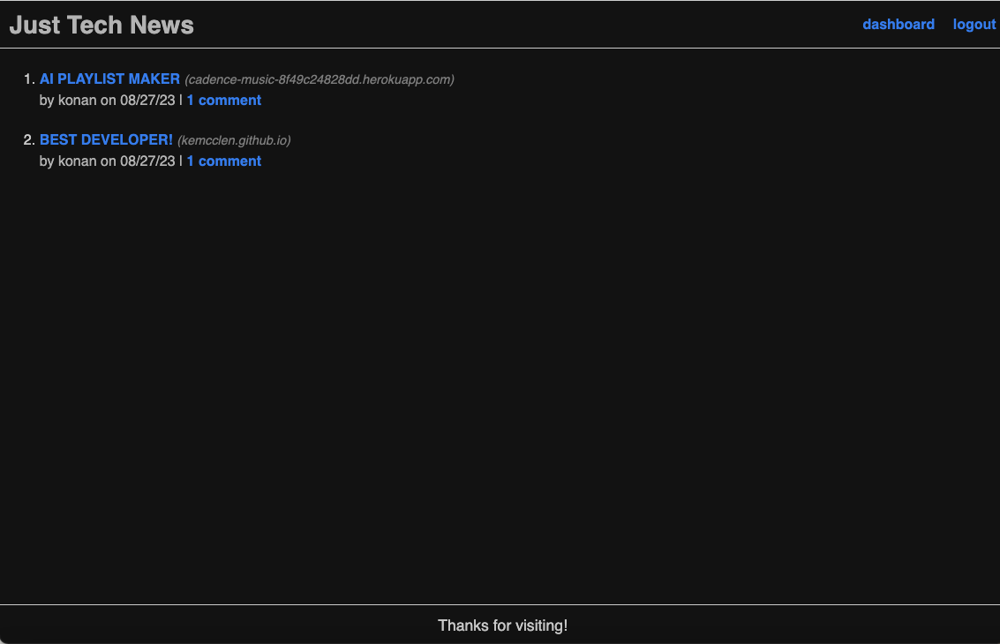
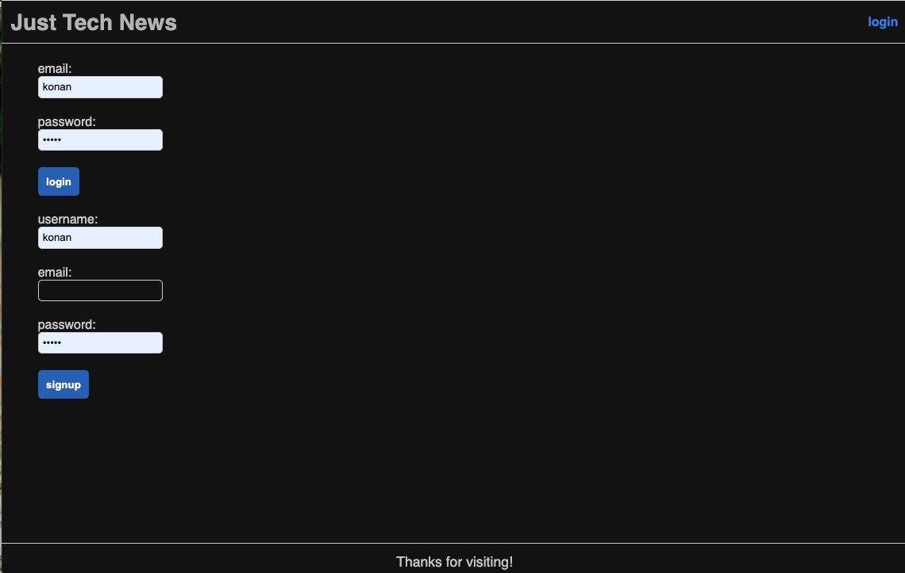
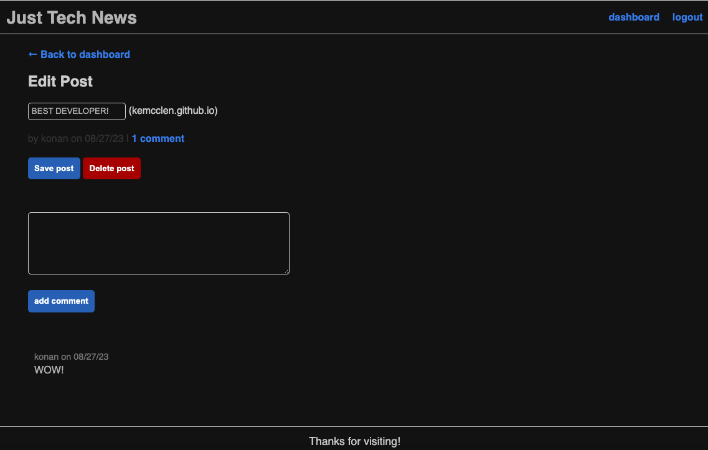

# Just Tech News

## Description
Just Tech News is an application that enables users to submit tech-related links and provide comments on links shared by other users. The app's backend was refactored from an original Node.js-based version, which was initially developed as part of a tutorial in the U of T Coding Bootcamp Continuation courses.

## Table of Contents
- [Description](#description)
- [Usage](#usage)
- [Demonstration](#demonstration)
- [Contributions](#contributions)
- [Links](#links)
- [Technologies](#technologies)
- [License](#license)

## Usage
**Interface**: To access Just Tech News, please follow the [Heroku link](https://just-the-technews-e7c8d6309325.herokuapp.com/dashboard/edit/1).

**User Features**: As a user of Just Tech News, you can:
- Create an account
- Log into your account
- Create posts
- Update your posts
- Delete posts
- View others' posts
- Comment on posts
- Access your post page dashboard
- Log out

## Demonstration
1. **Home Page**

2. **Create an Account or Log into Your Account**

3. **Create a Post**

4. **Update a Post**

5. **Comment on a Post**

## Contributions
Contributions to Just Tech News are encouraged! If you have bug fixes, improvements, or new features to contribute, please submit a pull request. Here's how to contribute:

1. Fork the repository.
2. Create a new branch for your feature or bug fix.
3. Implement your changes in the new branch.
4. Commit your changes with a descriptive commit message.
5. Push your branch to your forked repository.
6. Initiate a pull request to the main repository.
7. Provide a clear and concise overview of your changes in the pull request.
8. Submit the pull request and await feedback or further instructions.

Note that by submitting a pull request, you grant permission to the project maintainers to license your work under the existing project license.

Thank you for considering contributing to Just Tech News! Your contributions are greatly valued.

## Links
- Repository: [GitHub](https://github.com/kemcclen/python-newsfeed)
- Deployed Application: [Heroku](https://just-the-technews-e7c8d6309325.herokuapp.com/dashboard/edit/1)

## Technologies
- Flask
- Jinja
- Heroku
- JavaScript frontend
- Python 3 backend

## License
Just Tech News is released under the [MIT License](https://opensource.org/licenses/MIT).

_The MIT License is an open-source license that allows modification, distribution, and use of the project for commercial and non-commercial purposes. This license provides flexibility to adapt the application to specific requirements._

_By contributing to Just Tech News, you agree that your contributions will be licensed under the same MIT License, ensuring the project remains open-source and accessible to the community._
